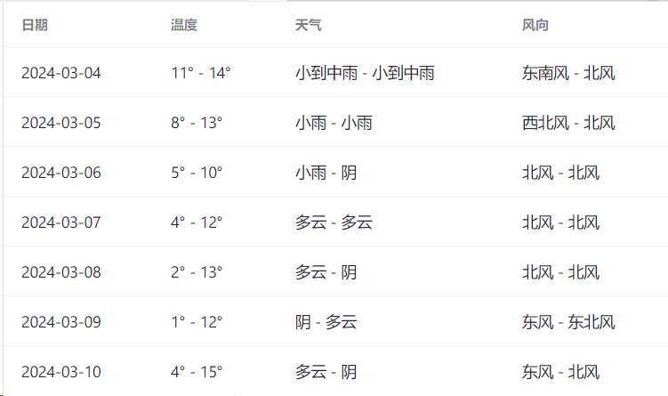

## chrome-extension-hangzhou-weather

> 快速显示杭州天气。

## 介绍

一个简单的练手项目，为了熟悉谷歌扩展商店发布流程。

用于快速查看杭州本地 7 天天气气候，包括温度风向等，安装可直接使用，无需其他权限，简洁明了。

基于 wxt + vue3 框架开发的插件。

## 使用

谷歌应用商店：[https://chromewebstore.google.com/detail/jbdcnnadgidhkifdgehoikdepoihkokf](https://chromewebstore.google.com/detail/jbdcnnadgidhkifdgehoikdepoihkokf)

无法进入商店可直接下载 `.output` 内的压缩包或下载 [releases](https://github.com/98zi/chrome-extension-hangzhou-weather/releases) 中名称前缀为 `hangzhou-weather.` 的压缩包，然后拖拽到浏览器扩展中。